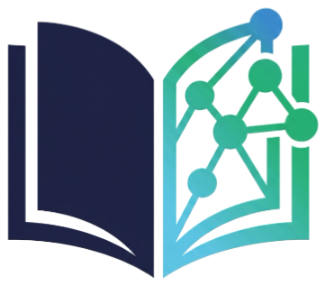
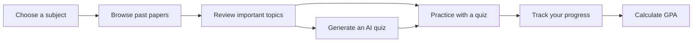

<div align="center">



# COMSATSPrepHub

### Prepare smarter. Practice better. Score higher.

<p>
  A student-focused exam preparation platform for COMSATS University students.
  Find past papers, practice with quizzes, generate AI-powered tests, and track
  your GPA in one place.
</p>

<p>
  <a href="https://comsatsprephub.vercel.app">Live Demo</a>
  &nbsp;&middot;&nbsp;
  <a href="https://github.com/MushtaqAhmadSaqi/Full-front-end/issues">Report an Issue</a>
  &nbsp;&middot;&nbsp;
  <a href="https://github.com/MushtaqAhmadSaqi/Full-front-end">View Source</a>
</p>

<p>
  
  
  
  
</p>

</div>

---

## Why COMSATSPrepHub?

Exam preparation should not mean searching through scattered files and old
messages. COMSATSPrepHub brings the most useful study tools into a focused,
mobile-friendly workspace.

| 📚 Past Papers | 🧠 Practice Quizzes | ✨ AI Quiz Generator | 🧮 GPA Calculator |
|:---:|:---:|:---:|:---:|
| Browse papers by subject | Revise important topics | Create personalized tests | Calculate SGPA and CGPA |

## ✨ Features

- **Past paper library** — Browse papers by subject and open detailed paper views.
- **Practice quizzes** — Test your knowledge with topic-based revision quizzes.
- **AI quiz generation** — Generate personalized COMSATS-style quizzes with AI.
- **GPA calculator** — Calculate semester GPA and cumulative GPA using COMSATS grading rules.
- **Student dashboard** — Keep useful study information and progress in one place.
- **Authentication** — Sign in with Supabase to unlock account-based features.
- **Dark mode** — Study comfortably in light or dark themes.
- **Responsive design** — Works across desktop, tablet, and mobile screens.
- **Command palette** — Quickly move between pages with `Ctrl + K` or `Cmd + K`.

## 🧭 How it works



## 🛠️ Tech stack

| Technology | Purpose |
|---|---|
| [React](https://react.dev/) | Component-based user interface |
| [Vite](https://vitejs.dev/) | Fast development server and production builds |
| [Tailwind CSS](https://tailwindcss.com/) | Utility-first styling |
| [Framer Motion](https://motion.dev/) | UI animations and transitions |
| [Supabase](https://supabase.com/) | Authentication and cloud data services |
| Gemini / Groq / OpenRouter | AI-powered quiz generation |

## 📁 Project structure

```text
.
├── api/                  # API and serverless route support
├── legacy/              # Older app code and legacy assets
├── public/              # Logos, icons, and static files
├── src/
│   ├── components/      # Reusable UI components
│   ├── constants/       # Shared application constants
│   ├── pages/           # Page-level React components
│   ├── services/        # Supabase and AI service integrations
│   ├── utils/           # Shared helpers and utilities
│   ├── App.jsx          # Root layout and client-side navigation
│   ├── main.jsx         # React entry point
│   └── index.css        # Global styles
├── .env.example         # Environment variable template
├── index.html            # Vite HTML entry
├── package.json          # Scripts and dependencies
├── tailwind.config.cjs   # Tailwind configuration
├── vite.config.js        # Vite configuration
└── README.md             # Project documentation
```

## 🚀 Getting started

### Prerequisites

- [Node.js](https://nodejs.org/) 18 or newer
- npm
- Supabase credentials for authentication features
- An AI provider key for AI quiz generation

### 1. Clone the repository

```bash
git clone https://github.com/MushtaqAhmadSaqi/Full-front-end.git
cd Full-front-end
```

### 2. Install dependencies

```bash
npm install
```

### 3. Configure environment variables

Create a local `.env` file from the template:

```bash
copy .env.example .env
```

Then configure the values required by your local setup:

```env
VITE_SUPABASE_URL=https://your-project.supabase.co
VITE_SUPABASE_ANON_KEY=your_supabase_anon_key

# Server-side AI keys
GEMINI_API_KEY=your_gemini_api_key
GROQ_API_KEY=your_groq_api_key
OPENROUTER_API_KEY=your_openrouter_api_key
```

> **Security note:** Never commit `.env` or expose server-side API keys in the browser.
> The repository's `.env.example` contains placeholders only.

### 4. Start the development server

```bash
npm run dev
```

Open the local URL shown in the terminal, usually
[`http://localhost:5173`](http://localhost:5173).

## 📜 Available scripts

| Command | Description |
|---|---|
| `npm run dev` | Start the Vite development server |
| `npm run build` | Create a production build |
| `npm run preview` | Preview the production build locally |
| `npm run test` | Run the project test script |
| `npm run analyze` | Build in analyze mode |
| `npm run build:css` | Build Tailwind CSS for legacy assets |
| `npm run watch:css` | Watch and rebuild legacy Tailwind CSS |

## 🌐 Deployment

The project is ready for Vercel-style deployment:

1. Import the repository into Vercel.
2. Add the required environment variables in the project settings.
3. Deploy the `main` branch.
4. Verify authentication and AI quiz generation in the deployed environment.

The public app is available at
[`comsatsprephub.vercel.app`](https://comsatsprephub.vercel.app).

## 🤝 Contributing

Contributions and suggestions are welcome. Before opening a pull request:

1. Create a focused branch for your change.
2. Run `npm run build`.
3. Run `npm run test`.
4. Include a clear description of the change and any screenshots for UI work.

## 📌 Notes

- The project contains both modern React code and legacy assets under `legacy/`.
- Authentication and saved student data depend on Supabase configuration.
- AI quiz generation depends on the configured provider and available API keys.
- Past papers are provided for educational revision and self-assessment.

## 📄 License

This project is intended for educational use by COMSATS students. Review the
repository and individual source files for any additional usage or licensing
requirements.

<div align="center">

Made for COMSATS students 💙

</div>
